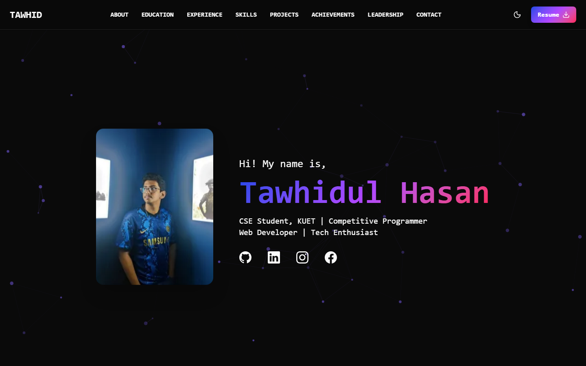
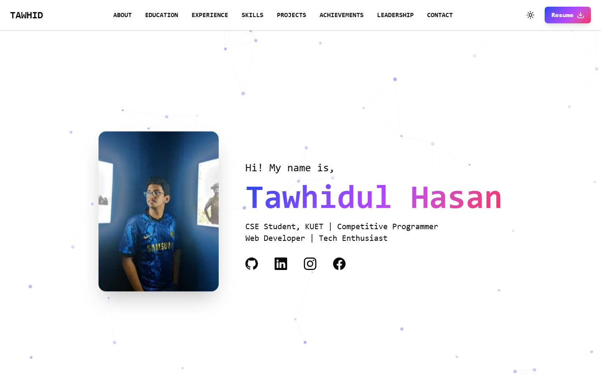
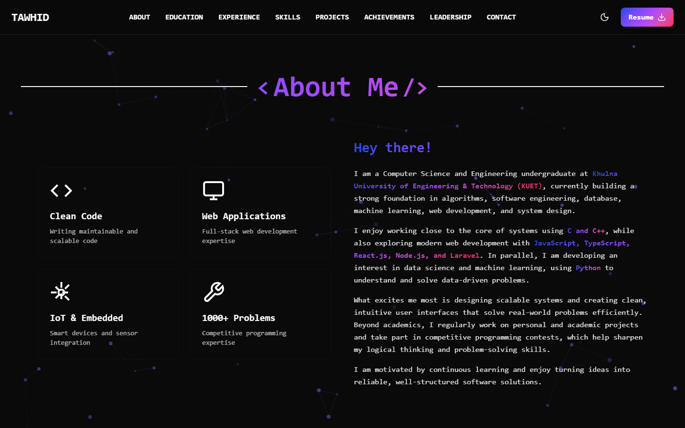
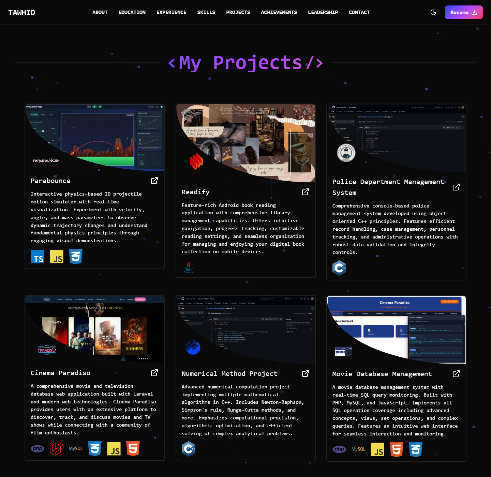
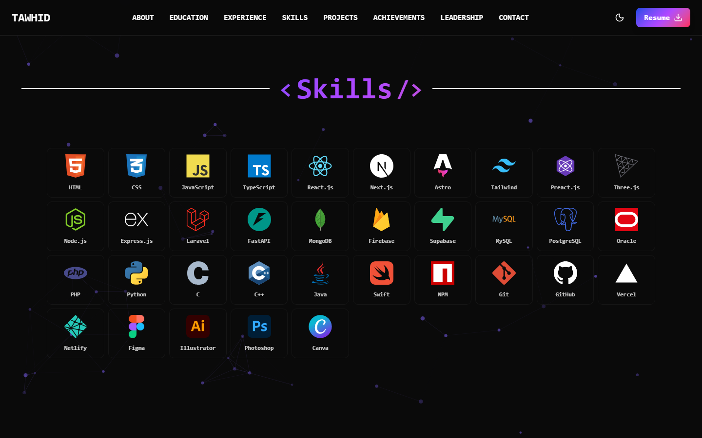
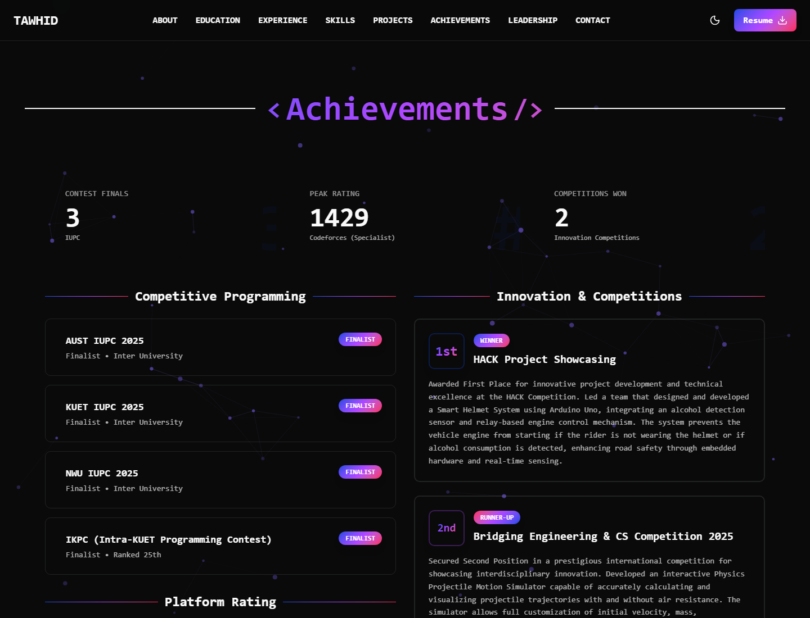
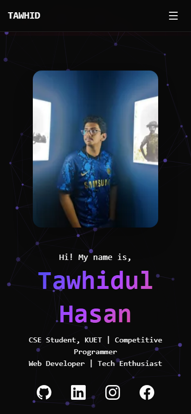

# Tawhidul Hasan — Portfolio

A fast, animated, single-page developer portfolio built with **Astro**, **TypeScript**, and **Tailwind CSS v4**. It showcases education, professional experience, technical skills, projects, competitive-programming and hackathon achievements, and leadership roles — all driven by typed content files so new entries can be added without touching markup.

[](https://astro.build)
[](https://www.typescriptlang.org/)
[](https://tailwindcss.com/)
[](https://preactjs.com/)
[](../LICENSE)

---

## Table of Contents

- [Preview](#preview)
- [Features](#features)
- [Tech Stack](#tech-stack)
- [Project Structure](#project-structure)
- [Getting Started](#getting-started)
- [Available Scripts](#available-scripts)
- [Content & Customization](#content--customization)
- [Deployment](#deployment)
- [License](#license)
- [Contact](#contact)

---

## Preview

<table>
  <tr>
    <td><strong>Hero — Dark Mode</strong></td>
    <td><strong>Hero — Light Mode</strong></td>
  </tr>
  <tr>
    <td></td>
    <td></td>
  </tr>
</table>

<details open>
<summary><strong>About</strong></summary>
<br/>

</details>

<details open>
<summary><strong>Projects</strong></summary>
<br/>

</details>

<details open>
<summary><strong>Skills</strong></summary>
<br/>

</details>

<details open>
<summary><strong>Achievements</strong></summary>
<br/>

</details>

<details>
<summary><strong>Mobile</strong></summary>
<br/>

</details>

---

## Features

- **Content-as-data architecture** — projects, skills, education, experience, achievements, and leadership entries live in typed `.ts`/`.astro` data arrays, not hardcoded JSX/HTML, so the site can grow without touching layout code.
- **Light & dark themes** — a manual toggle backed by `localStorage`, falling back to the visitor's OS preference (`prefers-color-scheme`) on first visit.
- **Fully responsive** — mobile-first layout with a dedicated slide-out navigation menu, tested from 390px phones up to desktop.
- **Scroll-spy navigation** — the active nav link updates automatically as each section enters the viewport.
- **Animated UI** — CSS keyframe fade/scale-in transitions on scroll, a floating profile picture, gradient text/borders, and an animated constellation-style particle background.
- **Optimized images** — all raster assets go through Astro's built-in image pipeline (`astro:assets`) for automatic `webp` conversion, responsive `srcset`, and lazy loading.
- **Working contact form** — submits directly to [Formspree](https://formspree.io/), no backend required.
- **Type-checked content** — every project/skill entry is validated against a TypeScript type at build time, so a malformed entry fails the build instead of shipping a broken card.

## Sections

| Section | What it shows |
| :--- | :--- |
| **Hero** | Name, role, profile photo, and social links |
| **About** | Short bio and four highlight cards |
| **Education** | Degrees, institutions, CGPA, and coursework |
| **Experience** | Professional roles and responsibilities |
| **Skills** | Categorized tech stack grid (frontend, backend, languages, tools) with links |
| **Projects** | Cards with description, tech stack, GitHub link, and status badge |
| **Achievements** | Competitive programming results, contest ratings, and hackathon/competition wins |
| **Leadership** | Club and organizational leadership roles |
| **Contact** | Social links + a working contact form |

## Tech Stack

| Category | Technology |
| :--- | :--- |
| Framework | [Astro 5](https://astro.build/) (static output) |
| UI Islands | [Preact](https://preactjs.com/) via `@astrojs/preact` |
| Styling | [Tailwind CSS 4](https://tailwindcss.com/) (via `@tailwindcss/vite`) + `tw-animate-css` |
| Language | TypeScript |
| Icons | [lucide-preact](https://lucide.dev/), [simple-icons](https://simpleicons.org/) (sourced as static SVG) |
| Fonts | [astro-font](https://github.com/rishi-raj-jain/astro-font) |
| SEO | [astro-seo](https://github.com/jonasmerlin/astro-seo) |
| Utilities | `clsx`, `tailwind-merge`, `class-variance-authority` |
| Image Processing | Astro's built-in `astro:assets` (Sharp) |
| Forms | [Formspree](https://formspree.io/) |

## Project Structure

```text
myPortfolio/
├── public/
│   ├── favicon.svg
│   └── Tawhidul_Hasan_CV.pdf        # Served statically, linked from the navbar
├── docs/
│   └── screenshots/                 # Images used in this README
├── src/
│   ├── assets/
│   │   ├── icons/                   # Tech-stack SVG icons + barrel export (index.ts)
│   │   └── images/                  # Project screenshots/logos + barrel export (index.ts)
│   ├── components/
│   │   ├── Navbar.astro             # Nav links, theme toggle, scroll-spy, resume download
│   │   ├── Hero.astro
│   │   ├── About.astro
│   │   ├── Education.astro
│   │   ├── Experience.astro
│   │   ├── Skills.astro
│   │   ├── SkillGrid.astro          # Renders a Skill[] into the grid UI
│   │   ├── Projects.astro           # Renders ProjectsList into project cards
│   │   ├── Achievements.astro
│   │   ├── Leadership.astro
│   │   ├── Contact.astro
│   │   ├── Footer.astro
│   │   ├── SectionTitle.astro       # Shared "<Title />" heading component
│   │   └── BackgroundParticles.astro
│   ├── layouts/
│   │   └── Layout.astro             # <html> shell, global styles, meta
│   ├── lib/
│   │   ├── ProjectsList.ts          # ⭐ All project content + tech-icon registry
│   │   ├── SkillStack.ts            # ⭐ All skill content, grouped by category
│   │   └── utils.ts
│   ├── pages/
│   │   └── index.astro              # Composes every section into the single page
│   └── styles/
│       └── global.css               # Theme tokens, gradients, keyframes
├── astro.config.mjs
├── components.json                  # shadcn/ui config (path aliases)
├── tsconfig.json
└── package.json
```

## Getting Started

### Prerequisites

- [Node.js](https://nodejs.org/) 18.20.8+ (tested on Node 24)
- npm 9+ (or your package manager of choice — pnpm/yarn/bun work too)

### Installation

```bash
git clone https://github.com/mayer-doa-coder/My_Portfolio.git
cd My_Portfolio/myPortfolio
npm install
```

### Development

```bash
npm run dev
```

The dev server starts at [`http://localhost:4321`](http://localhost:4321) with hot module reloading.

### Production Build

```bash
npm run build
npm run preview   # serve the ./dist build locally to sanity-check it
```

## Available Scripts

All commands run from `myPortfolio/`:

| Command | Action |
| :--- | :--- |
| `npm install` | Install dependencies |
| `npm run dev` | Start the local dev server at `localhost:4321` |
| `npm run build` | Type-check content and build the static site to `./dist/` |
| `npm run preview` | Preview the production build locally |
| `npm run astro check` | Run Astro's diagnostics/type-checker across `.astro` files |
| `npm run astro -- --help` | Show the Astro CLI help |

## Content & Customization

This portfolio is intentionally data-driven — most updates don't require touching component markup:

- **Add/edit a project** → `src/lib/ProjectsList.ts`. Each entry needs a `Logo`, `Shot`, and `Mockup` image (imported via `src/assets/images/index.ts`), a `Tech[]` array (pulled from the shared `TechInfo` registry in the same file), and a `features[]` list. Set `hideProject: true` to keep a card out of the grid without deleting it, or `Status: "development"` to show a "Under Development" badge.
- **Add a new tech icon** → drop an SVG into `src/assets/icons/`, export it from `src/assets/icons/index.ts`, then add it to `TechInfo` in `ProjectsList.ts` and/or the relevant stack array in `src/lib/SkillStack.ts`. Icons sourced from [simple-icons](https://simpleicons.org/) already ship with the correct brand color baked into the SVG `fill`.
- **Update education / experience / achievements / leadership** → each has its own component under `src/components/` with a small typed data array at the top of the file (`educationData`, `experienceData`, `leadershipData`) or inline JSX for `Achievements.astro`.
- **Change the resume** → replace `public/Tawhidul_Hasan_CV.pdf` (keep the filename, or update the two `href`s in `Navbar.astro`).
- **Retheme colors** → all theme tokens (light/dark) and the signature gradient utilities live at the top of `src/styles/global.css` as CSS custom properties in `oklch()`.

> **Note:** Projects added most recently (AgriSense AI, SignOLight, SlideCommander, etc.) currently render generated placeholder banners/logos under `src/assets/images/placeholders/`. Swap in real screenshots by replacing those files (or repointing the relevant `Shot`/`Logo`/`Mockup` import in `ProjectsList.ts`) once available.

## Deployment

The site builds to static HTML/CSS/JS (`output: "static"` in `astro.config.mjs`), so it can be deployed to any static host. Icon assets for both are already wired into the skills grid:

- **[Vercel](https://vercel.com/)** — import the repo, set the root directory to `myPortfolio/`, framework preset `Astro` (auto-detected).
- **[Netlify](https://www.netlify.com/)** — build command `npm run build`, publish directory `myPortfolio/dist`.

## License

Distributed under the [MIT License](../LICENSE).

## Contact

**Tawhidul Hasan**

- Email: [ttawhid401@gmail.com](mailto:ttawhid401@gmail.com)
- GitHub: [@mayer-doa-coder](https://github.com/mayer-doa-coder)
- LinkedIn: [tawhidul-hasan401](https://www.linkedin.com/in/tawhidul-hasan401/)
